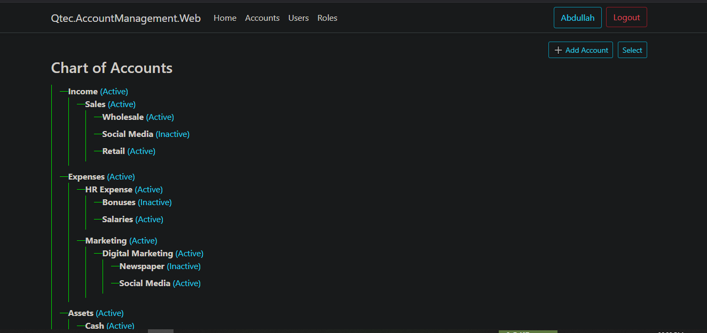
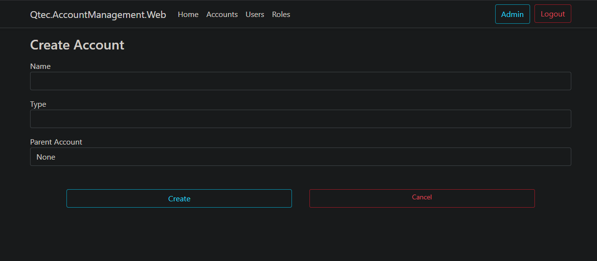
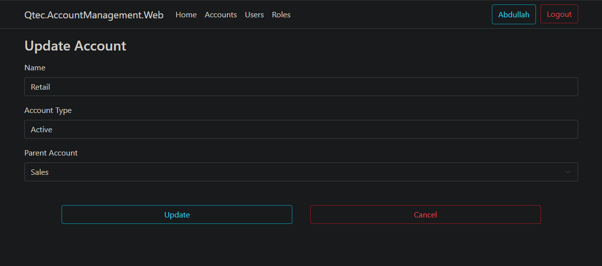
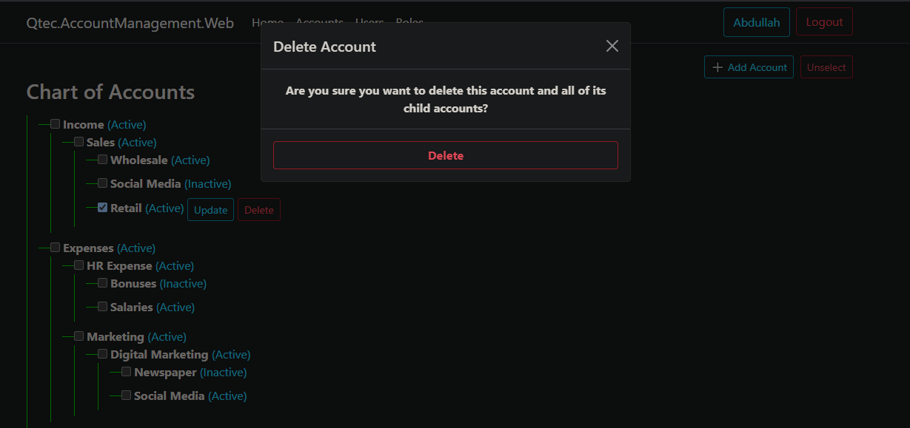
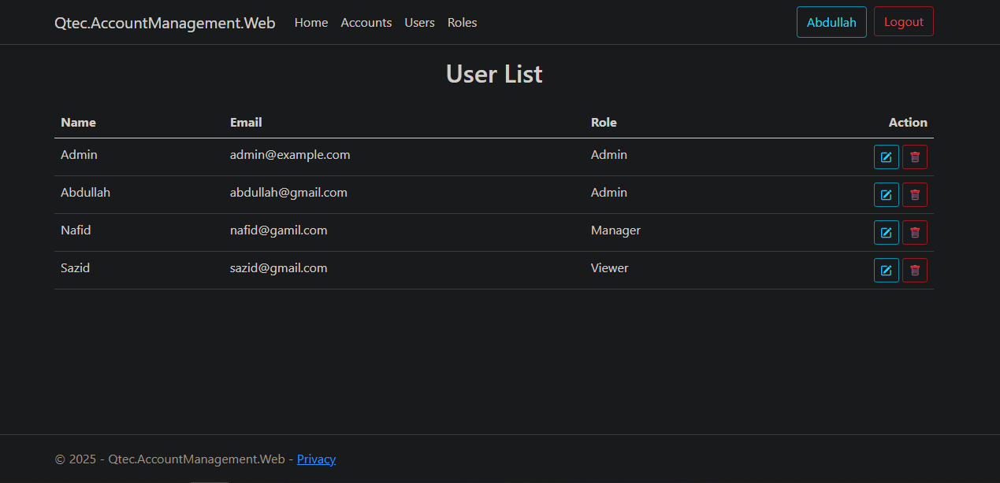
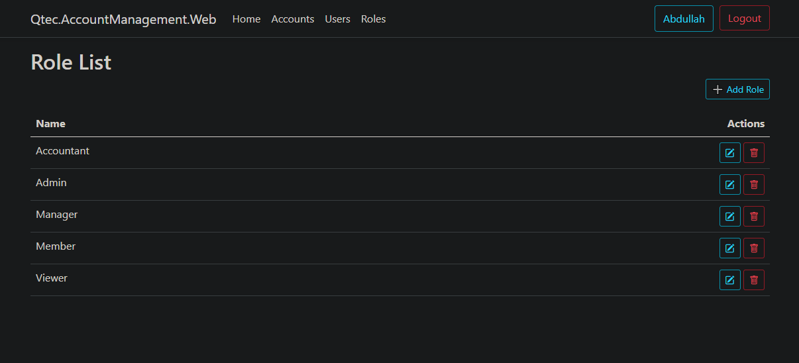
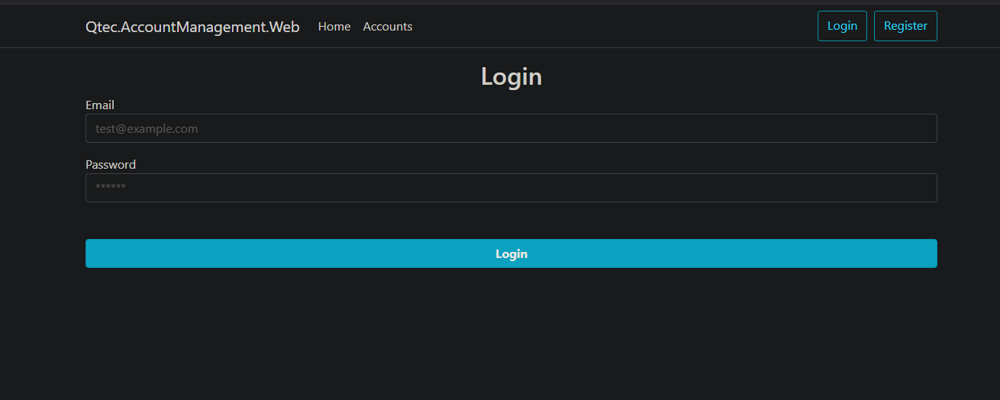
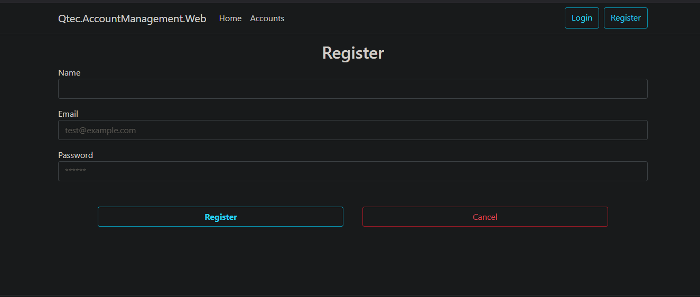

# Mini-Account-Management-System

### **Project Overview**
A robust ASP.NET Core Razor Pages application designed for a Mini Account Management System, following clean architectural principles with a focus on maintainability and scalability. 

#### **Key Features: **
  - Stored Procedure–based data access.
  - Hierarchical Chart of Accounts with Parent–Child relationships.
  - Bootstrap TreeView with node selection and contextual actions.
  - Full support for CRUD operations via sp_ManageChartOfAccounts.
  - Custom Identity integration with Role-based access control (Admin, Manager, Accountant, Viewer, etc.).
  - Access rights assigned per module/functionality.

#### **Technologies Used: **
  - ASP.NET Core Razor Pages
  - Serilog for logging
  - Autofac for dependency injection
  - SQL Server Stored Procedures for all data access

#### **Architecture & Patterns**
  - Clean Architecture
  - Repository and Unit of Work design patterns

  

  
  
  
  
  
  
  
  
